# 💍 Wedding All-in-One

> AI 웨딩플랜 · 쇼핑/커뮤니티 · 업체 탐색/예약 · 준비관리 · OpenClaw
> 결혼 준비의 모든 과정을 하나의 플랫폼에서 — 탐색부터 예약, 결제, 커뮤니티, AI 추천까지

**Notion**: [노션 페이지](https://app.notion.com/p/Team_SixFour-38367e72aa2780a6b0a9ef5203399855)
**YouTube**: [시연 영상](https://www.youtube.com/watch?v=Itr_3dvikuc)
**Fullstack-PDF**: [웨딩올인원(풀스텍).pdf](docs/pdf/wedding-allinone-fullstack.pdf)
**AI-PDF**: [웨딩올인원(AI).pdf](docs/pdf/wedding-allinone-ai.pdf)

 

## 목차

- [프로젝트 소개](#프로젝트-소개)
- [문제 정의 및 해결 방향](#문제-정의-및-해결-방향)
- [기술 스택](#기술-스택)
- [팀원 소개](#팀원-소개)
- [핵심 ERD](#핵심-erd)
- [유스케이스 다이어그램](#유스케이스-다이어그램)
- [성능 최적화](#성능-최적화)
- [배포](#배포)
- [트러블슈팅](#트러블슈팅)
- [주요 기능](#주요-기능)
- [AI 운영관제 (OpenClaw)](#ai-운영관제-openclaw)
- [회고](#회고)

 

## 프로젝트 소개

### 기획 배경

웨딩홀 대관료·식대·스드메 가격 구조가 제각각이고, 정확한 견적을 받으려면 여러 업체를 직접 상담해야 합니다.

- 가격이 계약 후에야 공개되는 정보 비대칭
- 지역·업체별 비용 격차로 합리적 비교가 어려움
- 홀·스드메·예산·일정이 사이트마다 흩어져 있음
- 반복 탐색 비용이 만혼·비혼 부담으로 이어짐

→ **가격 투명성 + 준비 과정 통합**이 필요합니다.

**참고 근거**

- 조선일보(2023) — 서울 웨딩홀 90곳 중 약 8할 인상, 스드메 300만원대 → 500만원 안팎 상승 언급 ([기사](https://www.chosun.com/national/national_general/2023/02/14/JYSICKCUXBC5LOZOBU2YGZQLEQ/))
- 세계일보(2019) — 평균 결혼비용 약 2억 3,186만원, 예식장 가격 비공개·추가비로 비교 자체가 어려움 ([기사](https://www.segye.com/newsView/20190410517854))

**핵심 수치**

| 식대 평균  | 전국 대관료 평균 | 강남 대관료 평균 |
| :--------: | :--------------: | :--------------: |
| 약 6.5만원 |    약 389만원    |    약 700만원    |

 

## 문제 정의 및 해결 방향

| #   | 문제                                                                                    | 해결                                                                               |
| --- | --------------------------------------------------------------------------------------- | ---------------------------------------------------------------------------------- |
| 1   | **정보 분산** — 웨딩홀·스튜디오·드레스·메이크업 정보가 여러 사이트/블로그/카페에 흩어짐 | **원스톱 흐름** — 검색 → 비교 → 찜 → 예약 → 결제까지 한 플랫폼에서 완결            |
| 2   | **수기 관리 한계** — 예산·일정을 엑셀/메모앱으로 관리하며 누락·중복 발생                | **준비관리 통합** — 체크리스트 + 예산 + D-day 연동으로 진행상황을 한눈에           |
| 3   | **비교 번거로움** — 동일 조건으로 비교가 어려움                                         | **AI 웨딩플랜 자동 추천** — 예산·날짜·하객수·스타일 입력만으로 업체 조합 자동 추천 |
| 4   | **문의 채널 파편화** — 전화·카카오톡·인스타DM 등으로 분산                               | **소통 통합** — 실시간 문의 채팅으로 업체-회원 커뮤니케이션을 플랫폼 내로 통합     |

 

## 기술 스택

### Frontend

### Backend

### Data & Infra

### External API

| 구분          | 스택                                                                                                                              |
| ------------- | --------------------------------------------------------------------------------------------------------------------------------- |
| Frontend      | React 18.3(Vite) · Redux Toolkit · React Router v7 · Axios · Tailwind CSS · STOMP/SockJS · Recharts                               |
| Backend       | Spring Boot 3.5 · Java 21 · Spring Security · Spring Data JPA · JJWT · WebSocket · Spring Mail/Validation · ModelMapper           |
| Data          | MariaDB(영속) · Redis(Refresh 토큰/블랙리스트 등 단기 상태)                                                                       |
| Infra         | AWS EC2 · Elastic Beanstalk · RDS · IAM                                                                                           |
| AI / External | OpenAI API(gpt-4o-mini, gpt-image-2) · Google Vision OCR · CatVTON(이미지 합성) · Kakao Login · Toss Payments · Daum 우편번호 API |

 

## 팀원 소개

### 황용현 · 팀장

- 답례품 쇼핑몰(장바구니/주문/결제) — REST CRUD + Toss Payments 연동
- 업체문의 실시간 채팅 — WebSocket(STOMP) + SockJS
- AI챗봇 — OpenAI Function/Tool Calling
- OpenClaw — AI 대시보드 주간브리핑/게시글·리뷰 욕설탐지/PDF생성

### 권용익 · 팀원

- 로그인 — JWT(Access/Refresh) + Spring Security + Redis(토큰/블랙리스트 TTL)
- 회원가입 — Spring Security(BCrypt) + 이메일 인증
- 회원관리·업체담당자 관리자 페이지, 관리자 대시보드(통계/차트)
- 커뮤니티 AI 한줄요약 프롬프트 설계·캐싱 로직

### 이재원 · 팀원

- AI 웨딩플랜 — OpenAI Chat Completions + 서버 슬롯 상태머신
- 커뮤니티 게시판 — OpenAI 한줄요약(캐싱)
- 준비관리(체크리스트/예산/웨딩플랜), 예약, 찜(업체), FAQ, AI 견적서(Quote) — Google Vision OCR + OpenAI

### 윤승진 · 팀원

- 업체관리(홀/드레스/스튜디오/메이크업 CRUD) — JPA + 파일 업로드
- AI 드레스 가상피팅 — 외부 CatVTON 이미지합성 API + OpenAI gpt-image-2(배경 교체)
- 업체 예약 일부

 

## 핵심 ERD

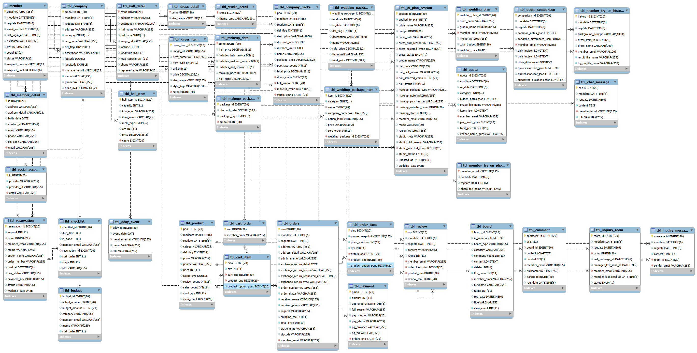

 

## 유스케이스 다이어그램

 

## 성능 최적화

### ① N+1 방지 — 목록과 이미지를 한 번에 조회

`@EntityGraph` `FetchType.LAZY` · 적용 화면: 홀/스드메 업체 목록

<table>
<tr><th colspan="2" align="center">최적화 코드</th></tr>
<tr>
<td>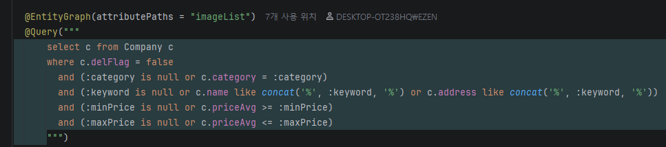</td>
<td>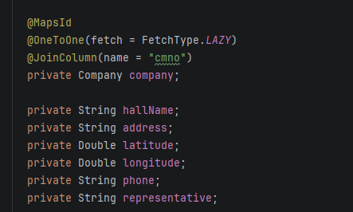</td>
</tr>
</table>

- `CompanyRepository`의 목록 조회 메서드에 `@EntityGraph(attributePaths = "imageList")`를 적용해, 업체 목록을 가져올 때 이미지도 함께 조회(N+1 제거)
- 가져온 이미지 중 첫 번째 이미지를 대표 이미지로 선택해 `CompanyListDTO`로 변환 — 프론트 업체 목록에서 이미지와 함께 표시
- 홀·스튜디오 상세정보는 `FetchType.LAZY`로 유지해 목록 조회 시 불필요한 데이터까지 가져오지 않도록 제한

**적용 화면**

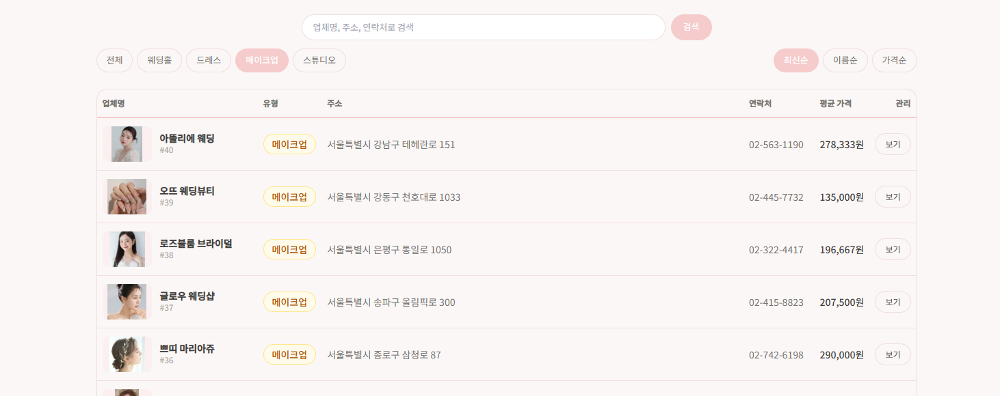

### ② 서버 사이드 페이징 — Page 단위로만 조회

`Pageable` `PRODUCT_LIST_PAGE_SIZE` · 적용 화면: 답례품 상품 목록

<table>
<tr><th colspan="2" align="center">최적화 코드</th></tr>
<tr>
<td>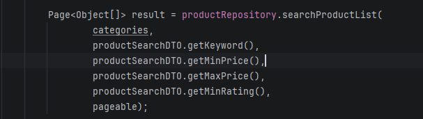</td>
<td>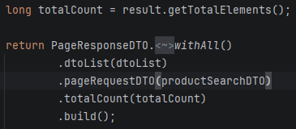</td>
</tr>
</table>

- 상품 검색 시 조건(카테고리·가격·평점·검색어)에 맞는 상품 전체를 가져오지 않고, 현재 화면에 보여줄 한 페이지 분량만 DB에서 조회
- 조회 결과의 전체 개수(`totalCount`)만 따로 뽑아 `PageResponseDTO`에 함께 담아 응답 — 프론트는 목록 데이터를 다시 요청하지 않고도 이 값 하나로 페이지 번호 네비게이션을 구성

**적용 화면**

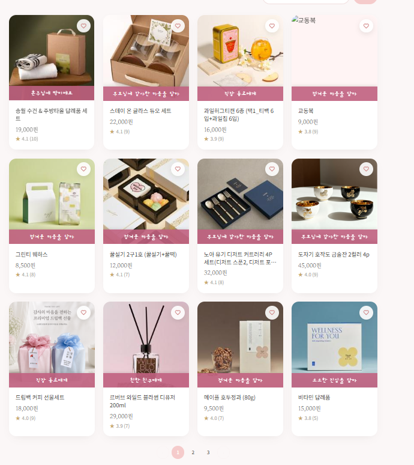

### ③ 라우트 단위 Code Splitting

`React.lazy` `Suspense`

<table>
<tr><th colspan="2" align="center">최적화 코드</th></tr>
<tr>
<td>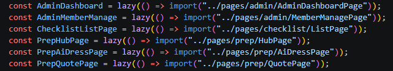</td>
<td>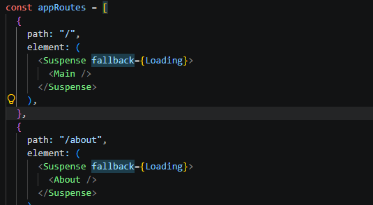</td>
</tr>
</table>

- 모든 페이지 코드를 한꺼번에 불러오지 않고, 각 페이지를 `React.lazy`로 감싸서 해당 페이지에 실제로 들어갈 때만 코드를 불러오도록 구성
- 그 코드가 아직 불려오지 않은 짧은 순간 화면에 무엇을 보여줄지는 `Suspense`가 담당(로딩 중 화면)
- 그 결과 사용자가 사이트에 처음 들어왔을 때는 지금 보고 있는 페이지 코드만 받으면 되고, 마이페이지·관리자 페이지처럼 아직 안 들어간 페이지 코드는 나중에 그 페이지로 이동할 때 받아 첫 화면이 뜨는 속도가 빨라짐

**적용 화면 (React DevTools Profiler 렌더 시간)**

| Before                                 | After                                |
| -------------------------------------- | ------------------------------------ |
| 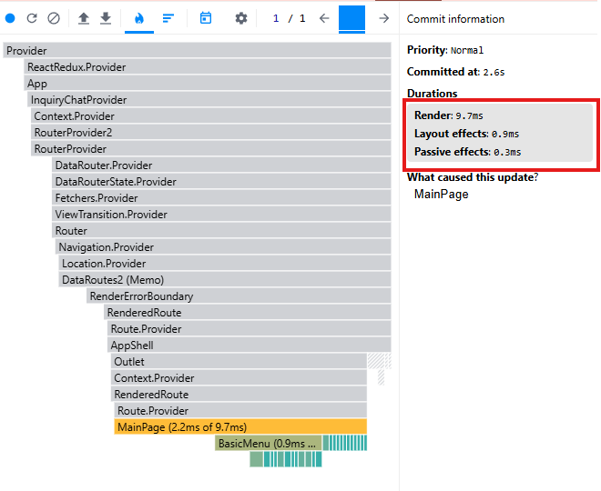 | 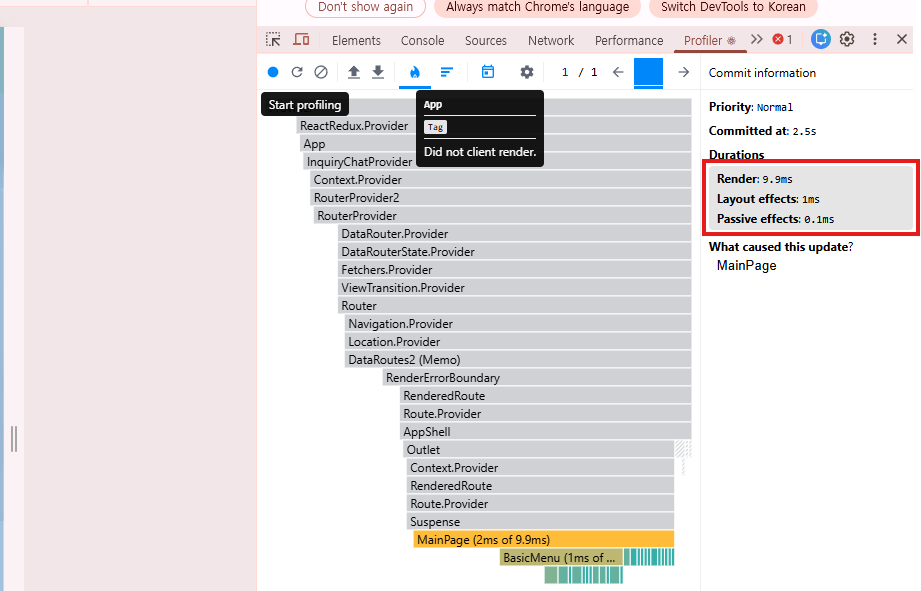 |

### ④ 반응형 웹 구현

`CSS Flexbox/Grid` `Media Query`

- PC·태블릿·모바일 등 다양한 디바이스 환경에 맞춰 레이아웃이 자동으로 변경되도록 구현하여 어떤 화면에서도 최적의 UI를 제공
- 화면 크기에 따라 컴포넌트의 크기와 배치, 여백을 유동적으로 조정해 가독성과 사용성을 높이고 직관적인 사용자 경험을 제공
- 다양한 해상도와 브라우저 환경에서도 일관된 UI/UX를 유지할 수 있도록 반응형 웹을 적용하여 접근성과 호환성을 향상

**적용 화면 (답례품 상세 — PC / 모바일)**

| Before (PC)                                         | After (모바일)                                    |
| --------------------------------------------------- | ------------------------------------------------- |
| 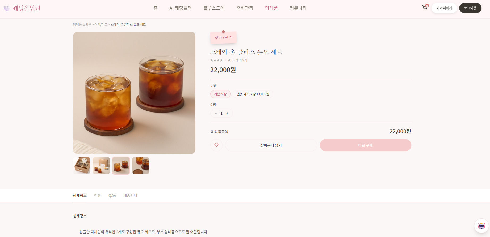 | 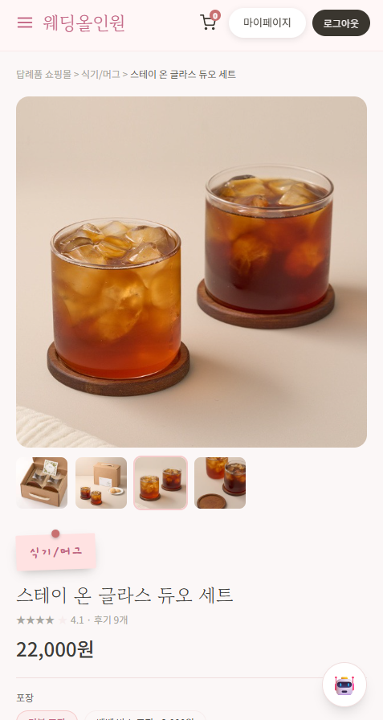 |

 

## 배포

### AWS 배포

`EC2` `Elastic Beanstalk` `RDS` `IAM`

- **EC2 + Elastic Beanstalk** — 애플리케이션을 배포하고, 일관된 서버 환경에서 안정적으로 서비스를 운영
- **RDS 연동** — 애플리케이션과 데이터베이스를 분리해, 데이터의 안정적인 저장 및 관리 환경을 구축 (port 3306, 보안그룹으로 EC2만 접근 허용)
- **IAM** — 사용자 및 권한을 관리하여 보안을 강화하고, AWS 리소스에 대한 접근 권한을 안전하게 제어
- 사용자는 SSH(22)를 통해서만 EC2에 접근 가능하도록 보안그룹을 제한

**배포된 서비스 화면**

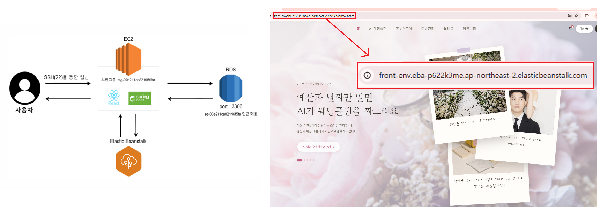

 

## 트러블슈팅

### ① 하드코딩된 서명 키로 관리자 토큰 위조 가능

| 문제                                       | 원인                                   | 해결                                            |
| ------------------------------------------ | -------------------------------------- | ----------------------------------------------- |
| 하드코딩된 서명 키로 관리자 토큰 위조 가능 | `JWTUtil.java`에 고정 문자열로 키 저장 | `JWT_SECRET` 환경변수로 분리하고 랜덤 키로 교체 |

| BEFORE (하드코딩)                               | AFTER (환경변수 분리)                         |
| ----------------------------------------------- | --------------------------------------------- |
| 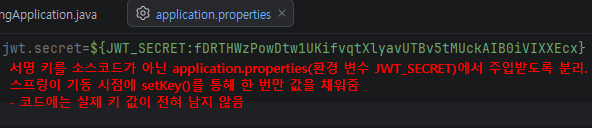 | 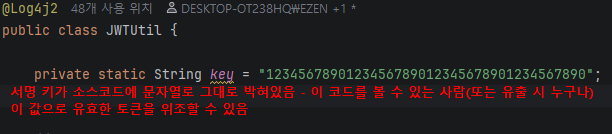 |

**Postman 검증 (BEFORE / AFTER)**

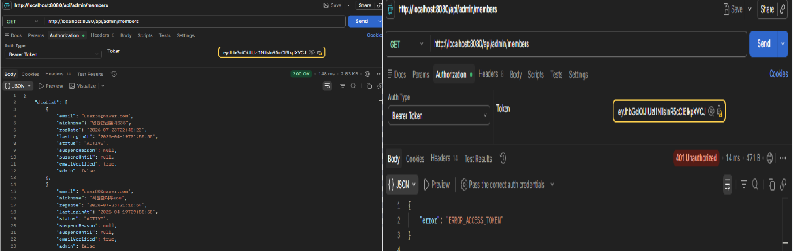

### ② 결제 승인 API 중복 호출 시 오류 노출

| 문제                                     | 원인                                     | 해결                                        |
| ---------------------------------------- | ---------------------------------------- | ------------------------------------------- |
| 결제 승인 API 중복 호출 시 409 오류 노출 | PAID 확인 없이 토스 승인 API를 반복 호출 | 이미 PAID 상태면 기존 결제 결과를 즉시 반환 |

<table>
<tr><th colspan="2" align="center">중복 결제 방지 코드</th></tr>
<tr>
<td>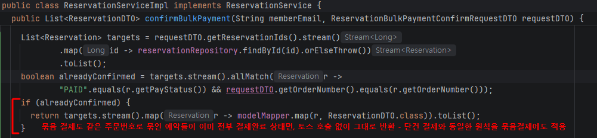</td>
<td>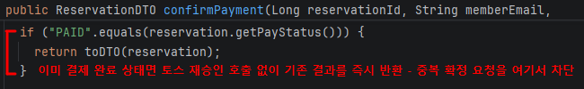</td>
</tr>
</table>

**Postman 검증 (BEFORE / AFTER)**

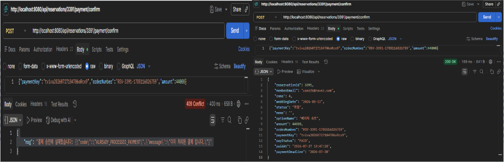

### ③ AI 웨딩플랜 "다시 찾기" 시 업체가 무작위로 바뀌는 문제

| 문제                                                                                                 | 원인                                                                                             | 해결                                                                                                                |
| ---------------------------------------------------------------------------------------------------- | ------------------------------------------------------------------------------------------------ | ------------------------------------------------------------------------------------------------------------------- |
| 제외(X)한 업체를 '다시 찾기'로 되돌리면, 원래 업체가 아닌 매번 다른 업체·추천 사유가 무작위로 표시됨 | 제외 처리 시 선택 업체·추천 사유를 함께 초기화(null)해, 복원할 정보가 없어 매번 새로 검색·재생성 | 제외 시 상태만 `EXCLUDED`로 바꾸고 선택 정보는 보존 → '다시 찾기'는 새로 검색하지 않고 원래 업체·사유를 그대로 복원 |

**관련 코드**

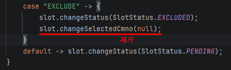

<table align="center">
<tr>
<th align="center">BEFORE (매번 다른 업체 표시)</th>
<th align="center">AFTER (원래 업체 그대로 복원)</th>
</tr>
<tr>
<td align="center">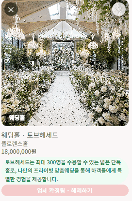</td>
<td align="center">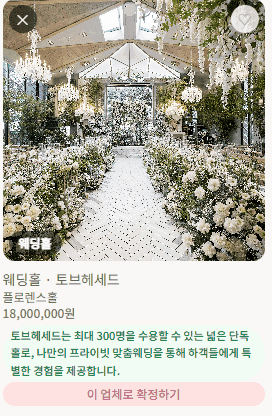</td>
</tr>
</table>

 

## 주요 기능

### 🔐 로그인 및 소셜로그인

`JWT` `Spring Security` `Redis`

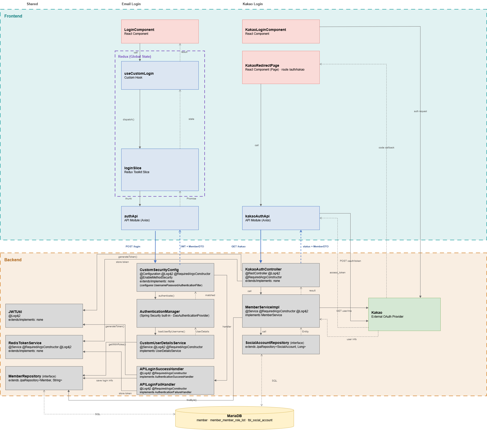

- 카카오 인증만으로는 로그인시키지 않고, 가입 완료 시점에만 진짜 로그인(JWT 발급) 처리
- Access/Refresh 만료시간을 상수로 표준화하고, refresh 토큰은 Redis에 TTL과 함께 저장해 자동 정리되도록 구성
- 로그인 성공/실패를 커스텀 핸들러로 가로채고, JWT 검증 필터를 앞단에 끼워 넣어 세션 없는 REST 인증 흐름을 구성

### 📝 회원가입

`Spring Security` `JWT`

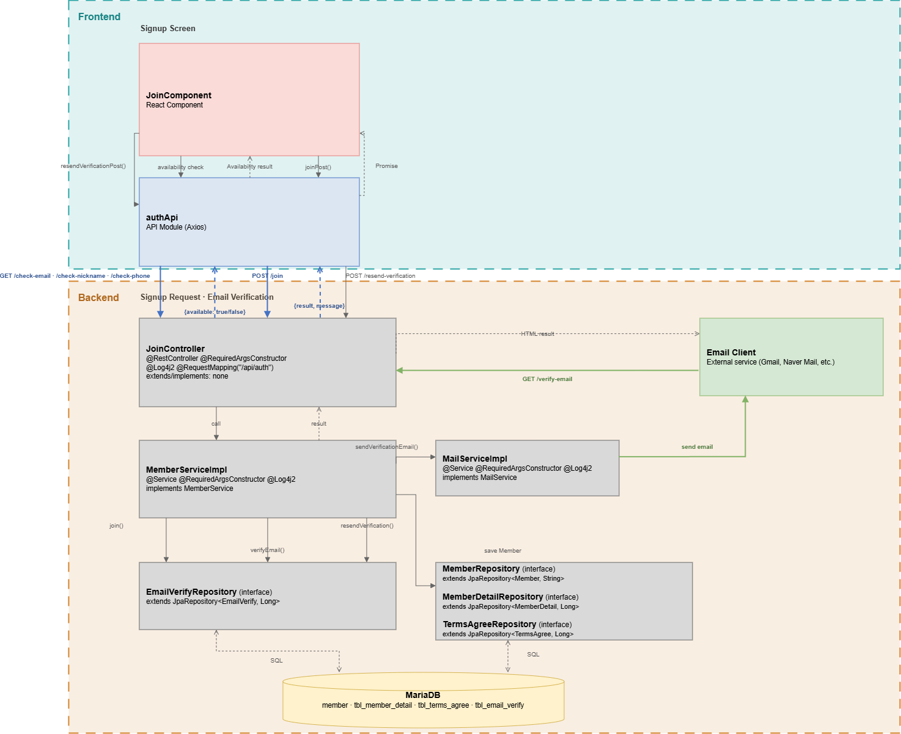

- 회원가입 요청 시점엔 Member 테이블에 아무것도 만들지 않고, 입력값 전체를 암호화된 비밀번호와 함께 JSON으로 Emailverify에 임시 저장
- 가입 신청과 이메일 인증 사이에 시간차가 있기 때문에, 그 사이 같은 이메일/휴대폰으로 다른 경로 가입이 먼저 끝났을 가능성을 인증 확정 직전에 한 번 더 검사
- 인증 메일을 못 받았거나 30분이 지나 만료됐을 때, 회원가입 폼을 처음부터 다시 채우게 하지 않고 이전에 저장해둔 payload(입력값 JSON)를 그대로 재사용하면서 토큰과 만료시간만 새로 발급

**일반 회원가입**

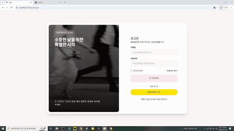

**소셜 회원가입**

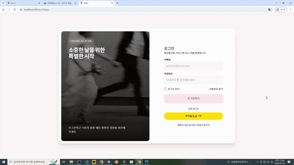

### 🏢 업체관리

`Spring Data JPA`

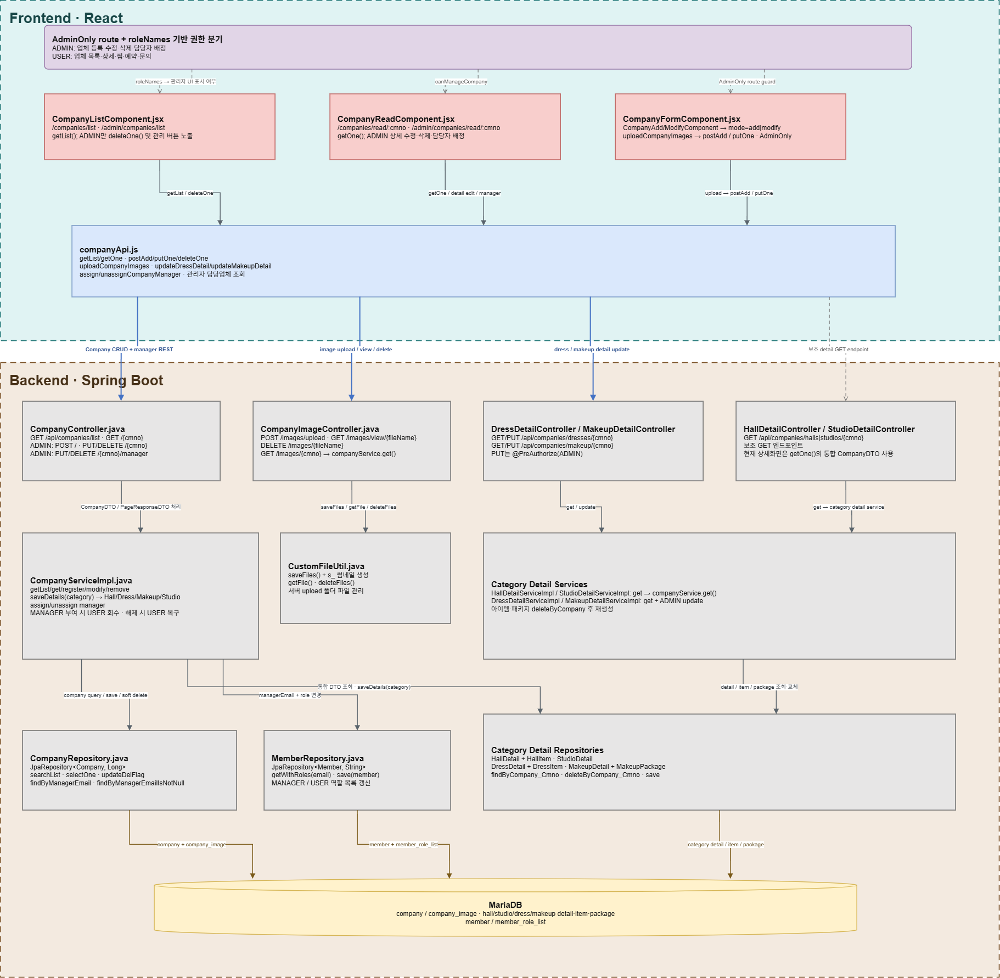

- 목록/검색/유형/필터, 등록/보기/수정/삭제가 컨트롤러의 list/CRUD 엔드포인트와 연결
- `roleNames`에 ADMIN이 있는지로 관리자 여부를 판단해 같은 업체 목록이라도 이동 경로를 `/admin/companies/list`(관리자용)와 `/companies/list`(일반유저용)로 분리하고, 등록/수정/삭제 API는 `@PreAuthorize("hasRole('ADMIN')")`로 서버 단에서 한 번 더 관리자 권한을 검증

**업체 상세조회 (일반 사용자)**

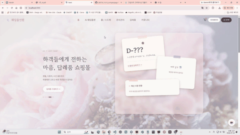

**업체 관리자 페이지**

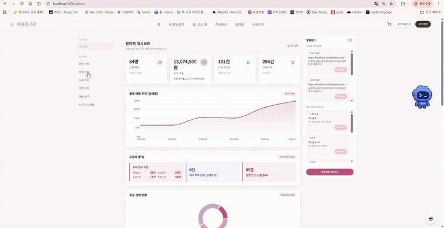

### 🎁 답례품

`REST CRUD` `Toss Payments`

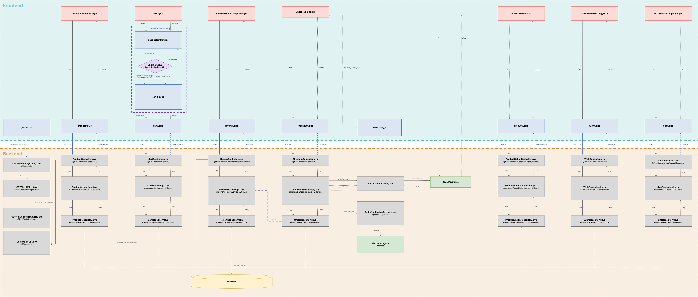

- 로그인 전엔 장바구니를 Redux 상태로만 유지하다가 로그인하는 순간 서버 DB로 이관 — 여러 상품을 한꺼번에 보내지 않고 `for...of` + `await`로 하나씩 순서대로 처리해 꼬임 방지
- 결제창을 띄우기 전 서버에서 먼저 주문을 만들어 실제 금액을 저장하고, 결제 승인 시점에 저장된 금액과 클라이언트가 보낸 금액을 대조 — 클라이언트 쪽 요청 조작으로 다른 금액이 결제되는 것을 방지

**장바구니 (Redux → DB 이관)**

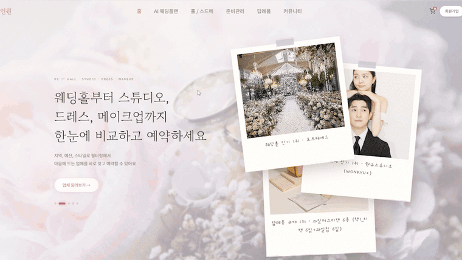

**결제**

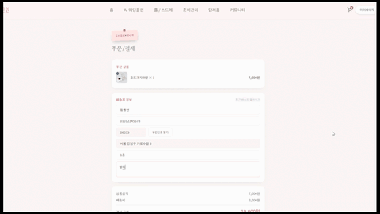

### 💬 커뮤니티 & AI 한줄요약

`Spring Data JPA` `OpenAI Chat Completions API`

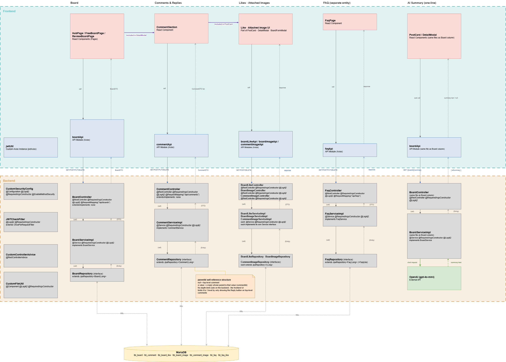

- 게시글마다 딱 한 번만 OpenAI를 호출하고 결과를 `Board.AISummary` 컬럼에 저장 → 이후 조회는 DB 캐시로 응답해 비용·응답속도 문제를 함께 해결. 글 수정 시엔 `changeAISummary(null)`로 캐시를 비워 다음 조회 때 재생성
- 본문 150자 미만인 글은 요약 의미가 없다고 판단해 API 요청 자체를 생략, 이미 캐시된 요약은 재요청하지 않음 — 불필요한 OpenAI 호출을 프론트 단에서부터 축소
- 서버는 댓글을 시간순 평평한 목록으로만 내려주고, `parentId` 유무로 최상위 댓글/대댓글을 나눠 프론트에서 트리 구조로 렌더링 — 부모 댓글이 삭제돼도 소프트 삭제 처리라 대댓글은 그대로 유지

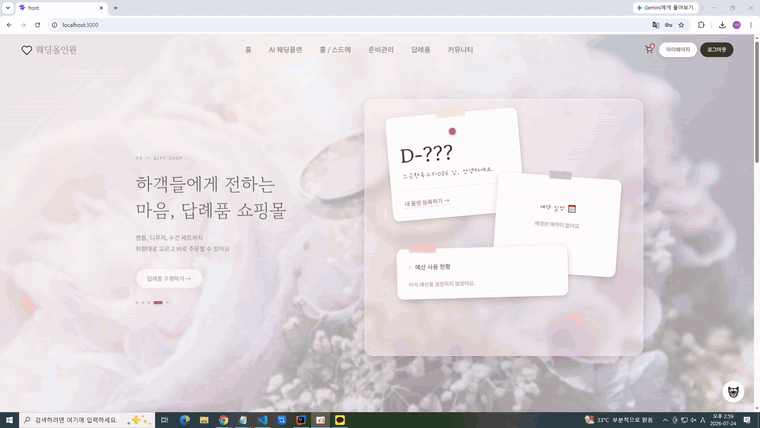

### 🤵 AI 웨딩플랜

`OpenAI Chat Completions(JSON)` `서버 슬롯 상태머신`

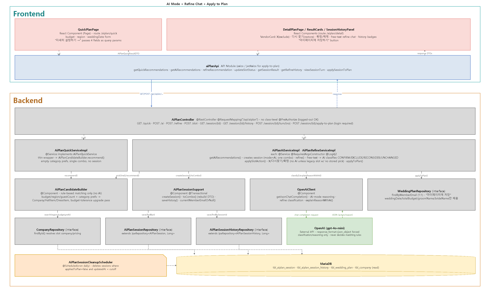

- 담기(플랜 적용)까지 이어지지 않고 방치된 세션만 골라 일정 기간 지나면 매일 자정 자동 삭제 — 실제 사용 중인 세션은 건드리지 않음
- 사용자의 자연어 요청을 AI가 JSON으로 강제 응답시켜 카테고리별 CONFIRM/EXCLUDE/RECONSIDER로 분류 — 파싱 실패 시 조용히 규칙 기반으로 넘어가지 않고 세션을 그대로 유지
- 1차 배분 후 남은 예산이 있으면 취향이 반영 안 된 카테고리부터 더 비싼 옵션으로 업그레이드 — 사용자가 명확히 취향을 지정한 카테고리는 예산 때문에 임의로 바꾸지 않음

**빠른 설정 → AI 추천 결과 → 재요청**

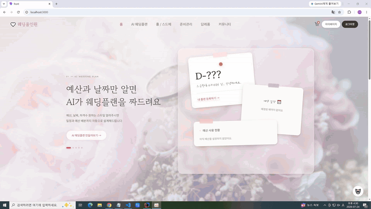

**추천 조합 확정 → 예약 진행**

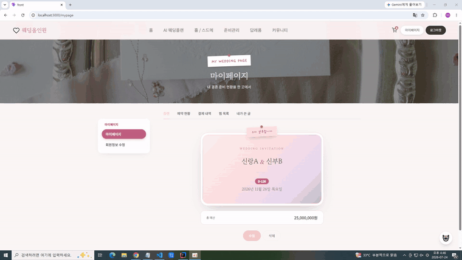

### 📩 업체 문의 (실시간 채팅)

`WebSocket(STOMP)` `SockJS` `JWT + STOMP 인증`

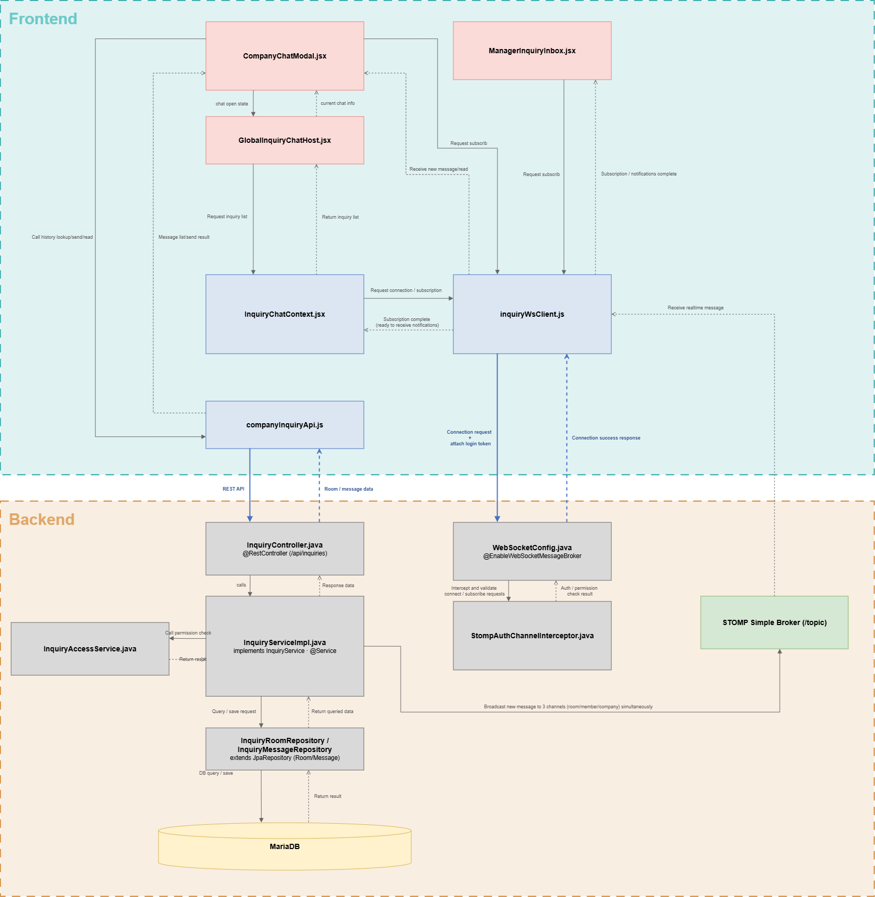

- WebSocket은 웹 브라우저와 서버 간 전이중(full-duplex) 통신 채널을 제공하는 프로토콜 — HTTP와 달리 한 번 연결되면 클라이언트·서버가 양방향으로 데이터를 동시에, 실시간으로 주고받을 수 있어 채팅 기능에 사용 (지연 시간 최소화 · 서버 푸시 · 헤더 오버헤드 절감으로 효율적인 통신)
- 메시지 저장은 REST API로 처리하고, 저장이 끝난 후 STOMP로 새 메시지 신호를 채팅방 화면·회원 알림뱃지·업체 매니저함 3곳에 동시 전파 — 저장(REST API)과 알림(STOMP)의 책임 분리
- 구독(SUBSCRIBE) 요청이 올 때마다 요청자가 해당 방/업체/이메일 알림을 볼 권한이 있는지 검증
- 인터넷이 끊긴 경우 5초마다 재연결을 시도해 자동으로 알림을 복구

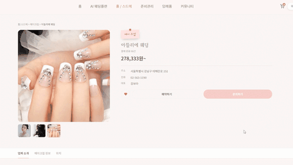

### 🤖 AI 챗봇

`OpenAI Function/Tool`

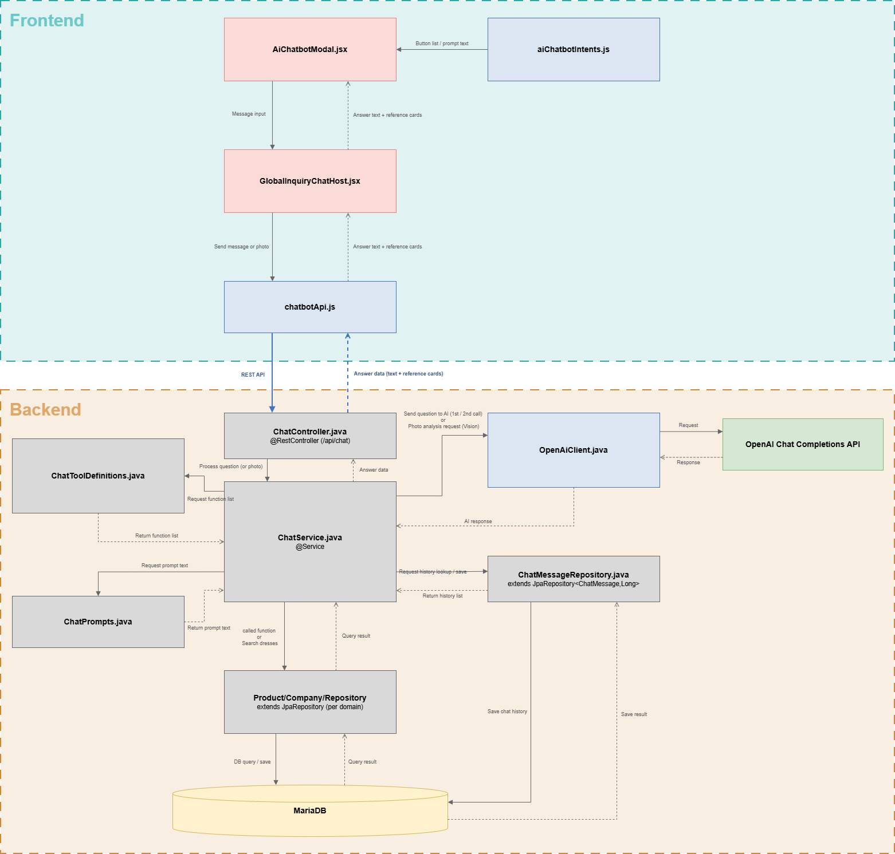

- 프론트엔드 · Spring Boot 백엔드 · OpenAI API를 연동한 챗봇 구조 — 사용자 질문에 지능적으로 답할 수 있도록 프롬프트와 로직을 체계화
- 1단계로 intent(4가지 버튼)로 좁혀진 함수 중 `tool_choice=required`로 반드시 하나를 고르게 하고(Function Calling), 2단계로 실제 DB 조회 결과를 다시 AI에게 보내 자연어로 답변을 받는 구조 — 덕분에 AI가 실제 데이터를 기반으로 답변
- 추출된 키워드마다 DB를 검색하고, 같은 드레스가 여러 키워드에 걸릴 때마다 매칭 점수를 1점씩 더해 겹치는 키워드가 많을수록 유사한 드레스로 판단
- 대화가 끊기거나 사라지지 않도록 DB에 안전하게 저장 — 멀티턴으로 이어지는 문맥을 유지

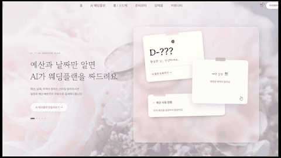

### 👗 AI 드레스

`외부 CatVTON 이미지합성 API` `OpenAI gpt-image-2`

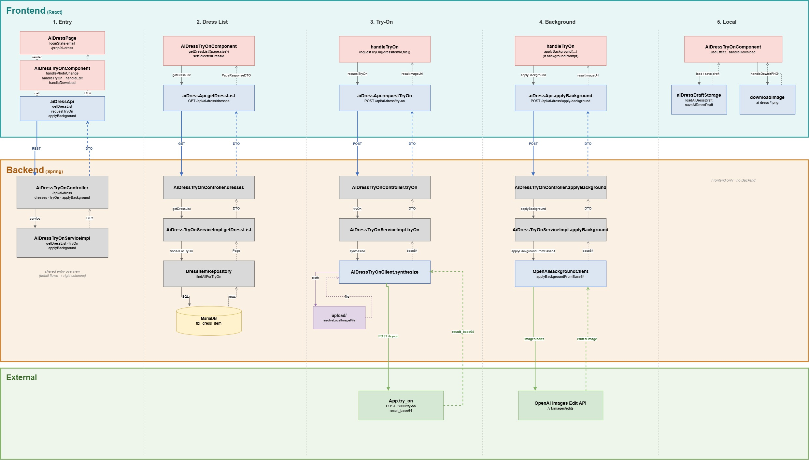

- Spring 백엔드가 인물 사진과 드레스 이미지를 외부 CatVTON 이미지합성 API(`/try-on`)로 전달하면, 마스크 생성 후 파이프라인에서 가상 피팅을 수행하고 결과 PNG를 Base64로만 반환 — 실제 모델 추론은 GPU 환경에서 파이프라인을 초기화해 처리
- 배경 합성은 OpenAI gpt-image-2가 담당 — 사용자가 입력한 프롬프트를 인식해 원하는 배경 이미지를 새로 생성
- 결과 이미지는 DB에 저장하지 않고 Base64로만 주고받다가, 사용자가 "저장하기" 버튼을 눌러야만 사용자 컴퓨터에 저장

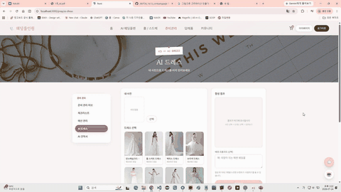

### 🧾 AI 견적서

`Google Vision OCR` `OpenAI Chat Completions(JSON)`

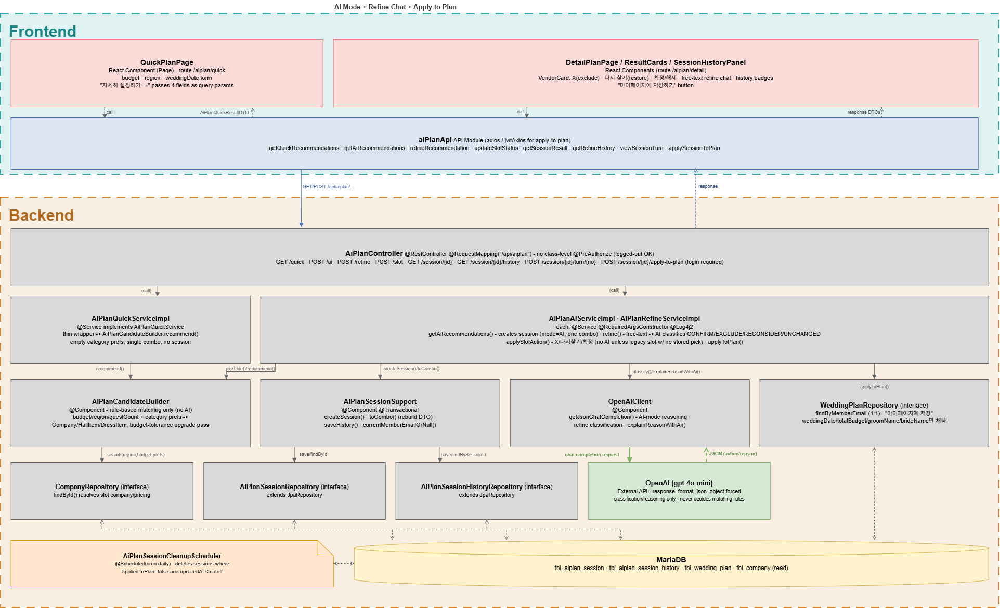

- 홀-홀, 드레스-드레스처럼 같은 종류끼리만 비교를 허용 — AI가 서로 다른 종류의 견적서를 놓고 "어느 쪽이 낫다"는 억지 비교를 하지 않도록 원천 차단
- 가격 차이 문구는 AI가 생성한 텍스트가 아니라 저장된 금액으로 서버가 직접 계산 — AI가 숫자를 잘못 세거나 콤마를 빠뜨리는 실수를 원천 차단
- AI가 웨딩 업체 견적서가 아니라고 판단하거나(자동차·가전 등) 카테고리를 확신 못하면 업로드 자체를 거절하고, 구체적인 거절 사유를 그대로 사용자에게 표시

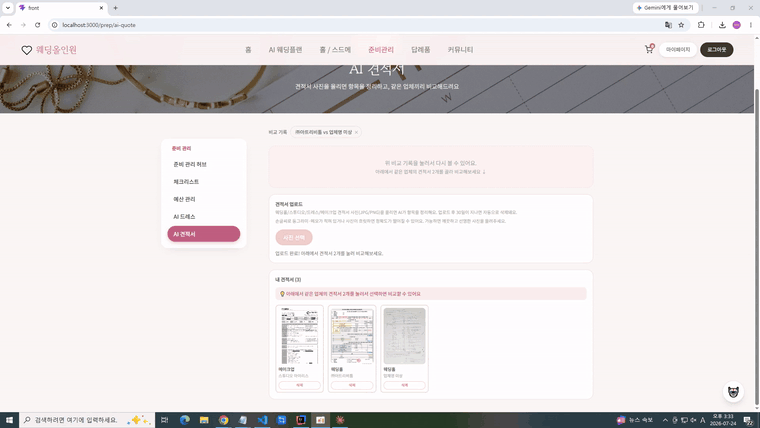

 

## AI 운영관제 (OpenClaw)

`OpenClaw(로컬 자동화 에이전트)` `스케줄 배치` `브라우저 자동조작`

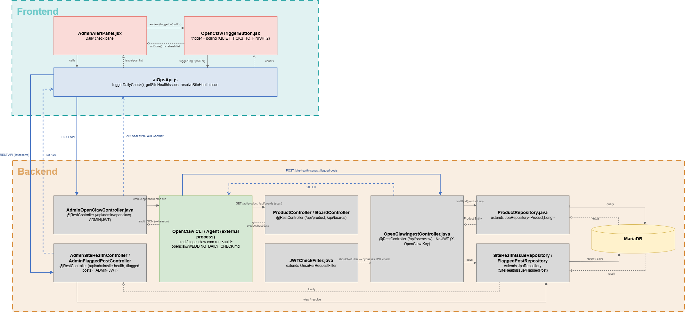

- 관리자가 대시보드 버튼을 클릭하거나 매일 새벽 3시가 되면(`wedding-daily-check`) 로컬에 설치된 OpenClaw CLI가 실행되어 일일 점검을 수행 — 매주 월요일 새벽 4시에는 한 주간 현황을 종합하는 주간 브리핑(`wedding-weekly-briefing`)도 동일한 방식으로 자동 트리거. 작업은 이름이 아닌 고유 ID로만 실행 가능해 실행 전 이름→ID 조회 과정을 거침
- 실행된 OpenClaw는 자체 판단으로 백엔드 REST API를 호출해 데이터 조회 및 정상 로드 여부를 직접 검증 — DB에 직접 접근하지 않고 백엔드 API를 통해서만 확인
- 점검을 마친 OpenClaw는 발견한 문제를 콜백 API로 전송하고, 서버는 이를 DB에 저장해 관리자 화면에 즉시 반영

**일일 체크**

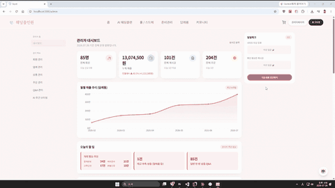

**AI 주간 브리핑**

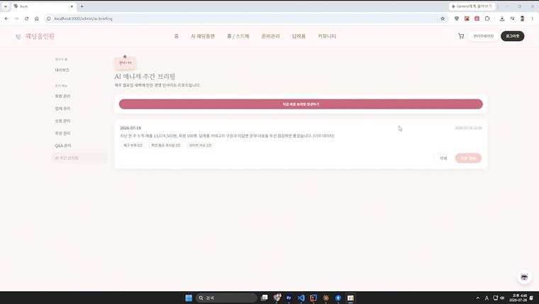

 

## 회고

| 🏆 주요 성과                                                                                                                                                                                                                                                                                                                                                        | 💡 배운 점                                                                                                                                                                                                                                                                                                                             |
| ------------------------------------------------------------------------------------------------------------------------------------------------------------------------------------------------------------------------------------------------------------------------------------------------------------------------------------------------------------------- | -------------------------------------------------------------------------------------------------------------------------------------------------------------------------------------------------------------------------------------------------------------------------------------------------------------------------------------- |
| - AI 4종 통합 — 웨딩플랜·챗봇·드레스·견적서를 하나의 플랫폼에서 유기적으로 연결 - 실시간 커뮤니케이션 구축 — WebSocket(STOMP) 기반 업체-회원 실시간 문의 채팅 완성 - 성능 최적화 4종 적용 — N+1 방지, 서버 사이드 페이징, 코드 스플리팅, 반응형 웹으로 체감 속도와 사용성 개선 - AWS 인프라 구축 — EC2·Elastic Beanstalk·RDS·IAM 기반 배포 파이프라인 완성 | - 보안은 나중이 아니라 처음부터 — JWT 시크릿 하드코딩을 겪으며 설정값 외부화 습관의 중요성 체감 - "동작한다" ≠ "안전하다" — 결제 승인 API는 여러 번 호출돼도 같은 결과가 나오도록 처음부터 설계해야 함을 체득 - 초기 DB 설계는 완성본이 아니었다 — 개발 중 필드는 물론 테이블까지 새로 추가되며 유연한 스키마 설계의 중요성 체감 |

| 🤔 아쉬운 점                                                                                                                                                  | 🚀 향후 계획                                                                                                                                                                                                                                                                                                                                                                                                   |
| ------------------------------------------------------------------------------------------------------------------------------------------------------------- | -------------------------------------------------------------------------------------------------------------------------------------------------------------------------------------------------------------------------------------------------------------------------------------------------------------------------------------------------------------------------------------------------------------- |
| - 코드 컨벤션 미통일 — 팀원별 주석 스타일 차이로 리뷰 시 맥락 파악에 시간 소요 - 테스트 자동화 미흡 — 트러블슈팅 재현을 수동 캡처에 의존, 회귀 테스트 부재 | - 로그인/회원가입 — 카카오 하나뿐인 소셜 로그인에 네이버·구글 추가, 휴대폰 본인인증(SMS) 연동으로 이메일 인증만으론 못 막는 허위가입까지 방지 - AI견적서 — 2개 견적서 비교만 가능한 걸 3개 이상 동시 비교로 확장, 항목별 시세 데이터와 비교해서 "이 항목이 평균보다 비쌉니다" 같은 인사이트 제공 - AI운영관제 — 이상 감지 시 텔레그램/슬랙으로 실시간 알림 발송, 주간 브리핑에 전주 대비 추이그래프 추가 |

 
